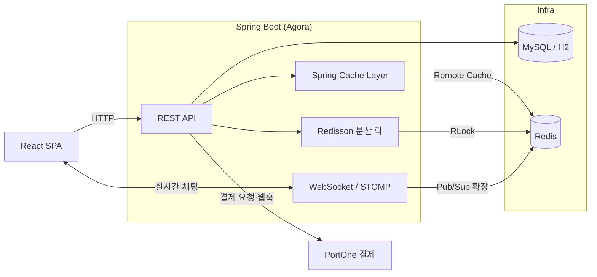
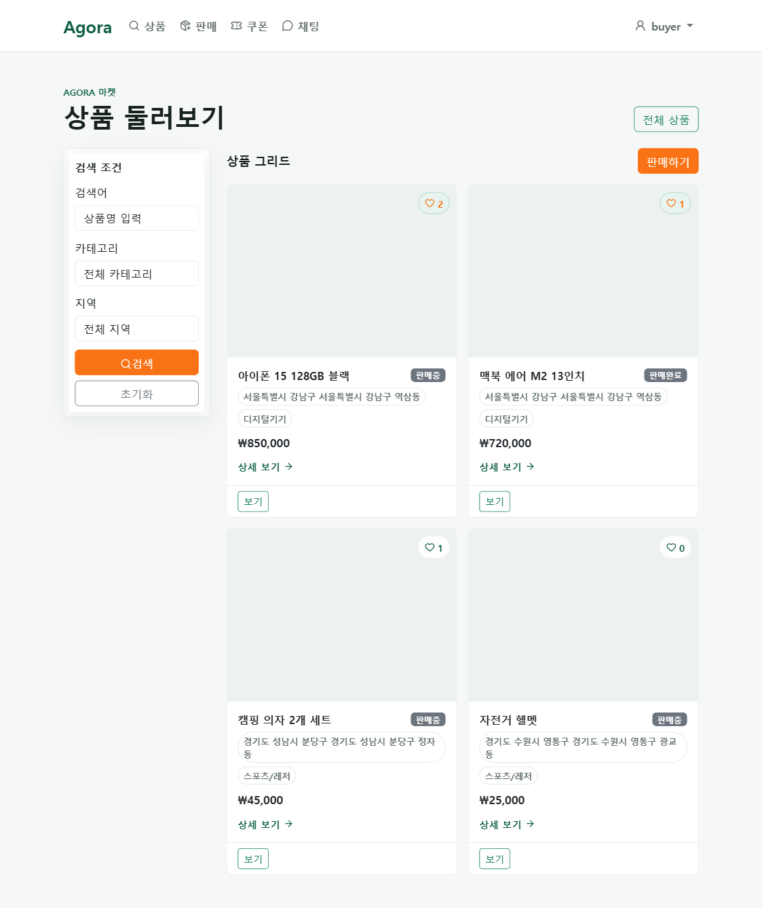
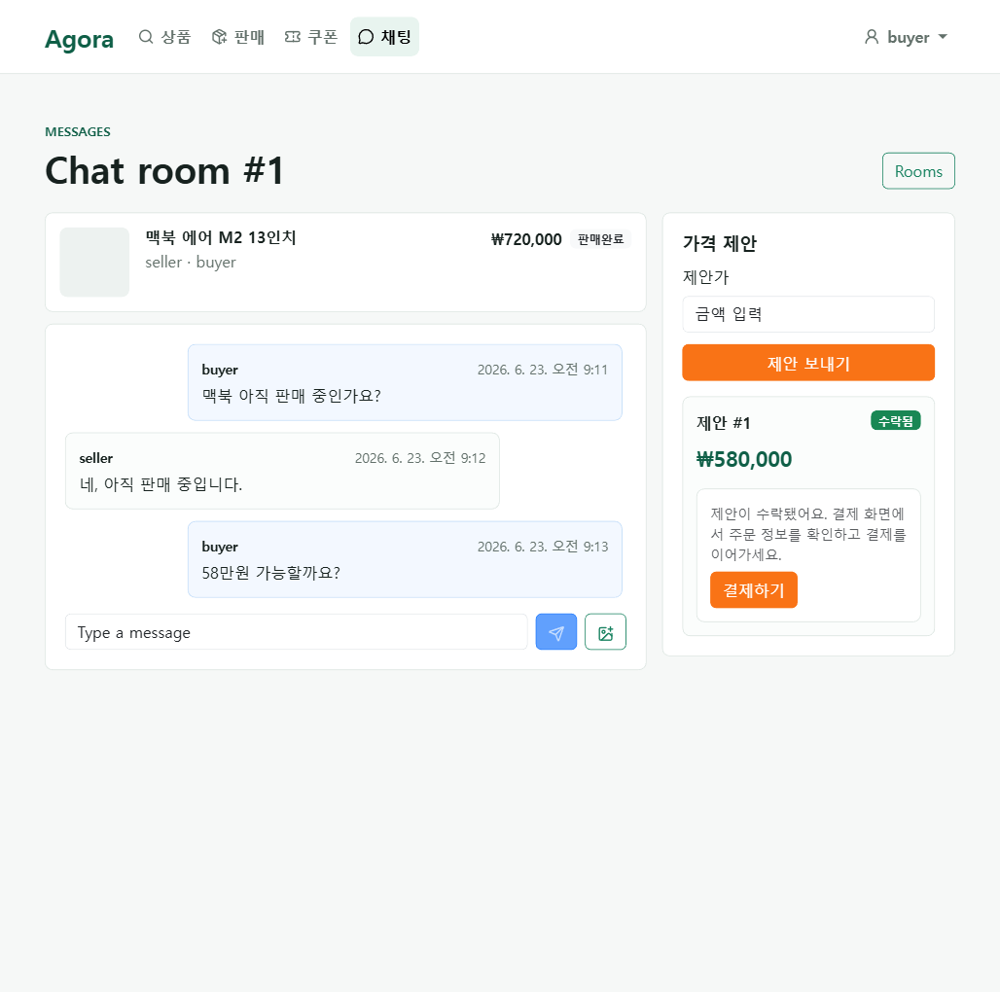
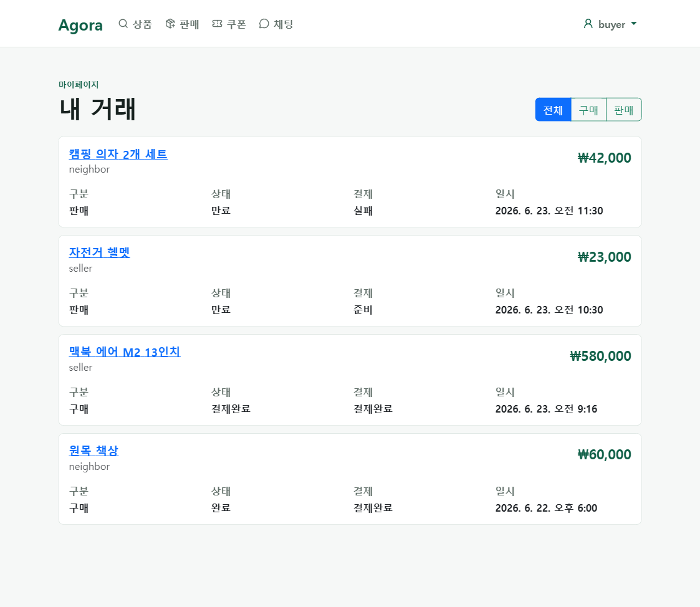

<div align="center">

# 🛒 Agora

**중고거래 커머스 플랫폼 백엔드**

실시간 채팅·네고(가격 협상)부터 선착순 쿠폰, 검색 캐싱, 결제·정산까지
하나의 중고거래 서비스를 처음부터 설계하고 구현한 백엔드 프로젝트입니다.

<br/>

[](https://github.com/sparta-spring4/Commerce-live-chat-system-Agora/actions/workflows/ci.yml)


</div>

- **개발 기간**: 2026.06.22 ~ 2026.07.03 (12일)
- **팀 구성**: 풀스택 4인 팀
- **저장소**: https://github.com/sparta-spring4/Commerce-live-chat-system-Agora
- **배포**: 미배포 (로컬 실행 환경 제공)

---

## 목차

1. [팀 구성](#팀-구성)
2. [프로젝트 소개](#프로젝트-소개)
3. [핵심 기술 챌린지](#핵심-기술-챌린지)
4. [기술 스택](#기술-스택)
5. [시스템 아키텍처](#시스템-아키텍처)
6. [스크린샷](#스크린샷)
7. [실행 방법](#실행-방법)
8. [테스트](#테스트)
9. [프로젝트 구조](#프로젝트-구조)
10. [CI / 협업 방식](#ci--협업-방식)
11. [문서](#문서)
12. [AI 활용 — Agent 협업 개발](#ai-활용--agent-협업-개발)

---

## 팀 구성

| 이름 | GitHub | 담당 도메인 |
|------|--------|------------|
| 이병우(팀장) | [116Lv](https://github.com/116Lv) | 프론트엔드(인증·마켓플레이스·채팅·결제·관리자 화면), 관리자/사용자 계정 분리, 후기·거래 목록 API |
| 남동엽 | [namdongyeob](https://github.com/namdongyeob) | 네고(오퍼 정책 강화·연장 1회 제한·수락 경쟁 조건 방지), 채팅 시스템 메시지 발행, 동시성·성능 테스트(k6) |
| 김소연 | [usersy628](https://github.com/usersy628) | 쿠폰(이벤트·선착순·관리자 정책·슬롯 구조 리팩토링), 지역, Flyway 초기 스키마 |
| 김준형 | [maschemy](https://github.com/maschemy) | 검색/캐싱(실시간·일간·Redis 전환), 신고, 인증 버그 수정, STOMP 채팅 버그 수정 |

---

## 프로젝트 소개

Agora는 **판매자와 구매자가 직접 거래하는 중고거래 커머스**입니다.
단순 CRUD를 넘어 실제 서비스에서 마주치는 문제 — 트래픽이 몰리는 검색, 순간적으로 요청이 쏟아지는 선착순 이벤트, 실시간 협상 — 을 어떻게 안전하고 빠르게 처리할지에 초점을 맞췄습니다.

구매자와 판매자가 채팅으로 가격을 협상하고, 판매자가 최종 승인하면 구매자에게 24시간 유효한 결제권이 부여되는 안전거래 구조를 중심으로 설계된 서비스입니다.

| 도메인 | 기능 |
|--------|------|
| 인증/회원 | 회원가입, JWT 로그인/로그아웃, 토큰 재발급, 마이페이지 |
| 상품/지역 | 상품 등록·수정·삭제(soft delete)·목록·상세, 이미지 업로드, 찜(좋아요), 지역 관리 |
| 검색/캐싱 | 동적 `LIKE` 검색(v1/v2), 인기 검색어(실시간·일별·주간) |
| 채팅 | WebSocket\STOMP 실시간 1:1 채팅, 채팅방 생성·조회 |
| 네고(가격협상) | 오퍼 제안·수락·취소·연장(1회 제한), 동시 수락 방지 |
| 거래/결제/정산 | 거래 생성·상태 관리, PortOne 결제 사전등록·검증·웹훅, 판매자 정산 |
| 쿠폰 | 쿠폰 정책 관리, 선착순 이벤트 발급, 개인 발급, 내 쿠폰 목록 |
| 신고 | 사용자·상품 신고 접수 및 관리자 처리 |
| 후기 | 스마일 점수(거래 후기·평점) |
| 관리자 | 관리자 계정 분리(ROOT/USER/PRODUCT/SETTLEMENT), 사용자·상품·신고·쿠폰 관리, 승인 요청 처리 |

> 설계·정책·도메인·API·ERD의 단일 출처(Source of Truth)는 **[GitHub Wiki](https://github.com/sparta-spring4/Commerce-live-chat-system-Agora/wiki)** 입니다.

---

## 핵심 기술 챌린지

이 프로젝트의 기술적 핵심은 **성능과 정합성**입니다. "적용 전/후를 실측으로 증명"하는 것을 목표로 진행했습니다.

### 1. 검색 캐싱 & 어뷰징 방지 — v1 vs v2 성능 비교 + Redis ZSET dedup TTL

트래픽이 몰리는 상품 검색을 캐싱으로 얼마나 개선할 수 있는지 검증했습니다.
기존 API를 지우지 않고 **버전을 분리**해, 동일 조건에서 캐시 유무만 다르게 두고 비교했습니다.

| 구분 | 엔드포인트 | 조회 경로 |
|------|-----------|----------|
| **v1** | `GET /api/v1/products/search` | 캐시 없음 → 매 요청 DB 조회 |
| **v2** | `GET /api/v2/products/search` | Spring `@Cacheable` → **Redis Remote Cache** (TTL 60s) |

**적용 방식**
- `spring-boot-starter-cache` + `@EnableCaching`, AOP 기반 `@Cacheable`로 구현.
- 캐시 저장소는 Redis(`RedisCacheManager`), TTL 60초.
- **Cache Key 설계**: 검색어·지역·카테고리·페이지를 조합해 조건별로 분리 → 캐시 충돌 방지.
  `'search:' + keyword + ':' + regionId + ':' + category + ':' + page + ':' + size`
- **Cache-aside(Lazy Loading)** 전략: 캐시 미스일 때만 DB를 조회하고 결과를 채운다.

**k6 부하 테스트 결과** (MySQL 상품 5만 건, 300 vUser Ramp-up, 실측)

| 지표 | v1 (캐시 X) | v2 (Redis 캐시) | 개선 |
|------|------------|----------------|------|
| **처리량(TPS)** | 744 req/s | **1,538 req/s** | **약 2.07배** ⬆ |
| 평균 응답 | 172.77 ms | **63.28 ms** | 2.7배 빠름 |
| 중앙값 | 131.78 ms | **55.64 ms** | 2.4배 빠름 |
| p95 | 375.53 ms | **263.39 ms** | 1.4배 빠름 |
| 실패율 | 0.00% | 0.00% | — |

> 💡 캐시는 단순히 평균 응답만 줄이는 게 아니라, **같은 인프라로 감당 가능한 동시 사용자 수(처리량 상한)를 끌어올립니다.**
> v1은 DB 조회가 병목이 되어 TPS가 744에서 정체(포화)됐지만, v2는 캐시가 DB 부하를 흡수해 포화점이 더 높은 부하 쪽으로 이동했습니다.

**인기 검색어 어뷰징 방지 — Redis SETNX dedup**

인기검색어는 Redis ZSET 점수를 기반으로 랭킹을 집계하는데, 동일 사용자가 같은 키워드를 반복 검색하면 실제 관심도와 무관하게 랭킹이 왜곡되는 문제가 있었습니다.

```
검색 요청 → keyword normalize
  ↓
SETNX popular:keyword:dedup:{userId}:{keyword}  (TTL 1분)
  ├─ 성공 → 인기검색어 score +1
  └─ 실패 → TTL 내 중복 검색 → score 증가 없음
```

`setIfAbsent`가 원자적으로 동작하므로 중복 여부를 경쟁 조건 없이 판단할 수 있습니다. Redis **Sorted Set(ZSet)** 으로 검색어별 점수를 집계하고 상위 N개를 조회합니다(`ZINCRBY`로 카운트, `ZREVRANGE`로 랭킹). 실시간·일별·주간 랭킹을 각각 제공합니다.

캐싱·검색 전략 상세 → [Wiki - Caching Strategy](https://github.com/sparta-spring4/Commerce-live-chat-system-Agora/wiki/Caching-Strategy) · [Wiki - Domain Search Caching](https://github.com/sparta-spring4/Commerce-live-chat-system-Agora/wiki/Domain-Search-Caching)

---

### 2. 동시성 제어 — 선착순 쿠폰 & 거래

> **"5장 한정 쿠폰에 30명이 동시에 몰려도 정확히 5장만 발급된다."**

순간적으로 요청이 쏟아져도 데이터 정합성이 깨지지 않아야 하는 지점에 락을 적용했습니다.

**락 방식 비교 분석**

| 항목 | 낙관적 락 | 비관적 락 | **분산 락 (채택)** |
|------|----------|----------|-----------------|
| 관리 주체 | Hibernate `@Version` | DB Row Lock | Redis (Redisson `RLock`) |
| 보호 범위 | UPDATE 충돌 감지 | DB 수정 시점 | **비즈니스 로직 전체** (조회→검증→발급) |
| 적합 상황 | 충돌 적고 읽기 많음 | 단일 서버·충돌 잦음 | **Scale-out(서버 여러 대)** |
| 단점 | 충돌 잦으면 재시도 비용 | 락 대기·데드락 | Redis 의존성 |

**설계 결정**
- **선착순 쿠폰 → 분산 락(Redisson)**: 서버가 여러 대로 확장돼도 이벤트 단위로 정확히 직렬화되어야 하므로 분산 락을 선택했습니다.
  - Lock Key: `lock:coupon-event:{eventId}` — 같은 이벤트 경쟁자는 하나의 락을 공유하고, 다른 이벤트는 독립적으로 발급됩니다.
  - `tryLock(waitTime)` 으로 획득 실패 시 즉시 `CONFLICT`로 응답(무한 대기 방지), `finally`에서 **본인이 잡은 락만 해제**.
  - 트랜잭션 경계 분리: 락 획득(`CouponSlotService`)과 DB 작업(`CouponSlotTransactionExecutor`)을 별도 빈으로 나눠, **락이 커밋보다 먼저 풀리는 문제**를 방지했습니다.
- **거래 성사 / 네고 수락 → 비관적 락**: 단일 상품 Row에 대한 짧고 잦은 충돌이라 DB Row Lock으로 직렬화했습니다.

```
[네고 수락 흐름]
오퍼 수락 요청
  ↓ NegoOffer FOR UPDATE
  ↓ Product FOR UPDATE
  ↓ 거래 생성 + 상품 RESERVED
  ↓ 같은 상품의 다른 활성 오퍼 일괄 CANCELLED
  ↓ 시스템 메시지 발송
```

> **DB 제약은 최후의 방어선.** 락이 만료되거나 Redis가 불안정한 상황까지 대비해, 유니크 제약 등 DB 레벨 정합성 가드를 함께 둡니다. 락은 경합을 줄이고, DB 제약이 최종 진실을 보장합니다.

**동시성 검증 테스트** — [`CouponSlotConcurrencyIntegrationTest`](src/test/java/com/team7/agora/domain/coupon/service/CouponSlotConcurrencyIntegrationTest.java): `CountDownLatch` + `ExecutorService`로 30개 스레드를 동시 출발시켜 5장 재고에 정확히 5장만 발급되는 것을 검증합니다.

동시성 전략 상세 → [Wiki - Concurrency Strategy](https://github.com/sparta-spring4/Commerce-live-chat-system-Agora/wiki/Concurrency-Strategy) · [분산 락 설계 노트](docs/redisson-distributed-lock-guide.md)

---

### 3. 인덱스 최적화

대량 데이터에서 느려지는 검색을 인덱스 설계로 개선했습니다. **자주 함께 쓰이는 조건**을 복합 인덱스로 묶어 커버리지를 높였습니다.

```java
// Product 엔티티 — 검색·필터 패턴에 맞춘 복합 인덱스
@Table(name = "products", indexes = {
    @Index(name = "idx_products_status_deleted",          columnList = "status, deleted_at"),
    @Index(name = "idx_products_region_status_deleted",   columnList = "region_id, status, deleted_at"),
    @Index(name = "idx_products_category_status_deleted", columnList = "category, status, deleted_at"),
    @Index(name = "idx_products_title",                   columnList = "title")
})
```

- 검색은 항상 `상태(판매중) + 미삭제`를 전제로 하므로 이 조건을 인덱스 선두에 배치했습니다.
- 지역·카테고리 필터가 자주 결합되므로 `(region, status, deleted)`, `(category, status, deleted)` 복합 인덱스를 별도로 두었습니다.

> 검색 쿼리는 QueryDSL 동적 쿼리로 작성되며, 최종 SQL은 `title`/`description`에 대한 `LIKE` 구문 + `Page` 기반 페이징(count 쿼리 분리)으로 나갑니다.

---

### 4. Refresh Token 다층 보안

**Problem**

Refresh Token은 Access Token보다 수명이 길어 단순 저장·검증 구조에서 여러 보안 위험이 존재합니다.

| 위험 | 시나리오 |
|------|---------|
| DB 유출 | 원문 토큰 저장 시 공격자가 즉시 재발급 가능 |
| 토큰 탈취 | 만료 전까지 계속 재사용 가능 |
| 동시 재발급 | 같은 토큰으로 동시 요청 시 복수 토큰 발급 |
| 비활성 회원 | 정지·차단·탈퇴 이후에도 Refresh Token으로 재발급 가능 |

**Solution**

4단계 방어를 적용했습니다.

```
1. Hash 저장     : DB에 원문 대신 hash 값만 저장 → DB 유출 시 원문 토큰 악용 불가
2. Token Rotation: 재발급 시 기존 토큰 삭제 → 탈취 토큰 재사용 위험 감소
3. FOR UPDATE    : 재발급 시 row lock → 동시 재발급 직렬화
4. 상태 재검증   : 로그인·재발급 시 ACTIVE 확인 → 비활성 회원 즉시 차단
```

신고·차단·탈퇴 같은 회원 상태 변경을 즉시 반영해야 하므로, Stateless Refresh JWT 대신 DB-backed Refresh Token 구조를 선택했습니다.

인증 도메인 설계 상세 → [Wiki - Domain Auth Member](https://github.com/sparta-spring4/Commerce-live-chat-system-Agora/wiki/Domain-Auth-Member)

---

### 5. WebSocket 채팅 버그 수정 — STOMP SEND principal null

**Problem**

채팅 메시지 전송(STOMP SEND 프레임) 시 `@MessageMapping` 핸들러에서 `principal`이 항상 `null`로 전달되어 NullPointerException이 발생했습니다.

**Cause**

`StompAuthInterceptor`가 CONNECT 프레임에서만 JWT를 파싱하고, 이후 SEND 등의 프레임은 인증 없이 그대로 통과시키는 구조였습니다. Spring Security의 `SecurityContext`는 WebSocket 세션 간에 유지되지 않으므로 CONNECT 이후 프레임에서 principal이 복원되지 않았습니다.

```
[Before]
CONNECT → JWT 파싱 → principal 설정 ✓
SEND    → 인증 없이 통과 → principal = null → NullPointerException ✗

[After]
CONNECT → JWT 파싱 → StompPrincipal을 세션 속성에 저장
SEND    → 세션 속성에서 StompPrincipal 복원 → principal 정상 전달 ✓
```

채팅·네고 도메인 설계 상세 → [Wiki - Domain Chat Nego](https://github.com/sparta-spring4/Commerce-live-chat-system-Agora/wiki/Domain-Chat-Nego) · [Wiki - Chat Nego Flow](https://github.com/sparta-spring4/Commerce-live-chat-system-Agora/wiki/Chat-Nego-Flow)

---

## 기술 스택

| 구분 | 기술 |
|------|------|
| **Language / Runtime** | Java 21 (Temurin) |
| **Framework** | Spring Boot 4.1, Spring Security, Spring WebSocket |
| **Persistence** | JPA(Hibernate), QueryDSL, MySQL 8(운영) / H2(로컬·테스트) |
| **Migration** | Flyway (운영 프로파일) |
| **Cache / Lock** | Redis 7, Spring Cache(`@Cacheable`), Redisson 분산 락 |
| **Realtime** | WebSocket + STOMP, Redis Pub/Sub |
| **Payment** | PortOne 결제 연동 |
| **Build / Test** | Gradle Wrapper, JUnit 5, k6(부하 테스트) |
| **Frontend** | React 19, Vite, Bootstrap, `@stomp/stompjs` |
| **CI** | GitHub Actions |

---

## 시스템 아키텍처



- **캐시·분산 락·인기 검색어**를 모두 Redis 한 곳으로 모아 인프라를 단순화했습니다.
- 채팅은 **Redis Pub/Sub**(`ChatRedisPublisher` / `ChatRedisSubscriber`)로 브로드캐스트해, 서버가 여러 대로 늘어나도 다른 서버에 붙은 구독자에게 메시지가 전달되도록 설계했습니다(Scale-out 대비).

---

## 스크린샷

| 상품 목록 | 채팅 + 네고 오퍼 | 거래 내역 |
|:---------:|:----------------:|:---------:|
|  |  |  |

---

## 실행 방법

### 사전 준비
- JDK 21 (Temurin)
- Docker (Redis 구동용)

### 1) Redis 실행

```bash
docker compose up -d redis
```

`docker-compose.yml`에 Redis 7 컨테이너가 정의되어 있습니다.

### 2) 백엔드 실행 (기본 `local` 프로파일 · H2 in-memory)

```bash
# macOS / Linux
./gradlew bootRun

# Windows
.\gradlew.bat bootRun
```

- 기본 프로파일은 H2(`MODE=MySQL`)로 뜨며 `data.sql` 시드가 자동 적재됩니다.
- H2 콘솔: `http://localhost:8080/h2-console` (JDBC URL `jdbc:h2:mem:agora_db`)
- jar로 직접 실행: `./gradlew clean build && java -jar build/libs/agora-0.0.1-SNAPSHOT.jar`

### 3) 프론트엔드 (선택)

```bash
cd frontend
npm install
npm run dev      # http://localhost:5173
```

> ⚠️ **Windows에서 프로젝트 경로에 한글이 포함된 경우**, 테스트 워커 classpath argfile이 깨질 수 있습니다.
> `~/.gradle/gradle.properties`에 `localBuildDir=C:/agora-build` 같은 **ASCII 경로**를 설정하세요(커밋 금지). 자세한 내용은 [`build.gradle`](build.gradle) 상단 주석 참고.

---

## 테스트

CI와 동일하게 **전체 통합 테스트를 포함한 `clean build`** 로 검증합니다. 통합 테스트는 전체 Spring 컨텍스트를 로딩하므로 단위 테스트가 못 잡는 스키마·설정 회귀를 잡아냅니다.

```bash
# 전체 빌드 + 테스트 (CI와 동일)
./gradlew clean build          # Windows: .\gradlew.bat clean build

# 단일 테스트
./gradlew test --tests "*CouponSlotConcurrencyIntegrationTest"
```

---

## 프로젝트 구조

```
src/main/java/com/team7/agora
├── domain/                # 도메인별 패키지 (controller · service · repository · entity · dto)
│   ├── product/ region/   # 상품 · 지역
│   ├── search/            # 검색 · 인기 검색어 · 캐싱
│   ├── chat/ nego/        # 실시간 채팅 · 가격 협상
│   ├── coupon/            # 선착순 쿠폰 (동시성)
│   ├── trade/ payment/ settlement/
│   ├── review/ report/ admin/
│   ├── auth/ user/
│   └── common/
└── global/                # 공용 인프라
    ├── config/            # Cache · Security · WebSocket 등 설정
    ├── lock/              # LockService (Redisson 분산 락 추상화)
    ├── websocket/  storage/  time/(AgoraClock)  exception/  response/

frontend/src
├── api/        # axios API 클라이언트
├── auth/       # AuthContext, 인증 훅
├── features/   # 도메인별 컴포넌트 (chat, nego 등)
└── pages/      # 라우팅 페이지
```

**컨벤션**
- 시간은 항상 `AgoraClock.now()`(UTC)를 사용합니다(테스트 시간 고정).
- 예외는 `BusinessException` + `ErrorCode`로 던집니다.
- DB 스키마는 두 경로(로컬 H2 `data.sql` / 운영 MySQL Flyway)를 함께 동기화합니다.

---

## CI / 협업 방식

- **GitHub Actions CI**: PR·dev push 시 `./gradlew clean build`(전체 통합 테스트 포함) 자동 실행, Redis 서비스 컨테이너 포함
- **브랜치 전략**: `dev` 기준 `feature/issue-<번호>-<설명>` 브랜치 → PR → 리뷰 → merge, `main`은 최종 배포 전용
- **이슈 트래킹**: `[도메인] 작업 내용` 형식 이슈, PR과 `close #번호`로 연결
- **협업 방식**: 이슈 단위 브랜치 → PR → 코드 리뷰 → `dev` 병합. 데일리 스크럼으로 진행상황을 공유하고, 트러블슈팅과 AI 활용 내역을 기록으로 남깁니다.
- **DB 이중 스키마 운영 원칙**: 개발(H2 `create-drop` + `data.sql`)과 운영(MySQL `validate` + Flyway) 환경이 달라, 엔티티 변경 시 ① 엔티티 필드 ② `data.sql` 시드 ③ Flyway 마이그레이션 세 곳을 항상 함께 수정합니다. 누락 시 H2 시드 실패(CI 통합 테스트 실패) 또는 MySQL `validate` 실패(운영 배포 실패)로 즉시 드러납니다.

---

## 문서

| 문서 | 링크 |
|------|------|
| 전체 API 명세 | [Wiki - API Contracts](https://github.com/sparta-spring4/Commerce-live-chat-system-Agora/wiki/API-Contracts) |
| Postman Collection | [docs/postman/agora-dev-smoke.postman_collection.json](./docs/postman/agora-dev-smoke.postman_collection.json) |
| ERD 상세 | [Wiki - ERD](https://github.com/sparta-spring4/Commerce-live-chat-system-Agora/wiki/ERD) |
| 도메인 상태 전이 | [Wiki - State Transitions](https://github.com/sparta-spring4/Commerce-live-chat-system-Agora/wiki/State-Transitions) |
| 동시성 전략 설계 | [Wiki - Concurrency Strategy](https://github.com/sparta-spring4/Commerce-live-chat-system-Agora/wiki/Concurrency-Strategy) |
| 캐싱 전략 설계 | [Wiki - Caching Strategy](https://github.com/sparta-spring4/Commerce-live-chat-system-Agora/wiki/Caching-Strategy) |
| 거래·결제 흐름 | [Wiki - Trade Payment Flow](https://github.com/sparta-spring4/Commerce-live-chat-system-Agora/wiki/Trade-Payment-Flow) |
| 분산 락 설계 노트 | [docs/redisson-distributed-lock-guide.md](docs/redisson-distributed-lock-guide.md) |
| 운영 규칙(브랜치·PR·리뷰) | [AGENTS.md](AGENTS.md) |

---

## AI 활용 — Agent 협업 개발

AI를 단순 코드 생성기가 아니라 **역할을 나눈 팀 동료처럼** 운영했습니다.
문서를 기준점으로 두고, 정책은 사람이 결정하며, 모든 산출물을 테스트·PR로 검증했습니다.

| 원칙 | 내용 |
|------|------|
| **문서 먼저** | Wiki·`AGENTS.md`·API 계약을 먼저 읽혀 맥락 없는 코드 생성을 막았습니다. |
| **정책은 사람이** | 수수료·환불처럼 모호한 결정은 `question` 라벨 이슈로 분리해 팀이 판단했습니다. (예: [#147](https://github.com/sparta-spring4/Commerce-live-chat-system-Agora/issues/147), [#159](https://github.com/sparta-spring4/Commerce-live-chat-system-Agora/issues/159)) |
| **Issue 단위 병렬** | 완료 조건이 있는 Issue로 분해하고, 독립 `git worktree`에서 병렬로 구현했습니다. |
| **PR 검증** | 통합 PR로 모아 `./gradlew clean build` + CI 통과를 확인한 뒤 병합했습니다. |
| **근거로 확인** | 실행하지 않은 테스트를 성공이라 말하지 않고, 실패 로그를 기준으로 수정했습니다. |

**실제 산출물**: [`AGENTS.md`](AGENTS.md)(운영 규칙) · 통합 PR [#160](https://github.com/sparta-spring4/Commerce-live-chat-system-Agora/pull/160) · `question` 이슈 [#147](https://github.com/sparta-spring4/Commerce-live-chat-system-Agora/issues/147), [#159](https://github.com/sparta-spring4/Commerce-live-chat-system-Agora/issues/159)

> `dev`/`main` 병합은 사람이 수행합니다([`AGENTS.md`](AGENTS.md) §5·§6). AI로 작성한 코드는 PR·스크럼에서 공유하고, 각자 코드 동작을 설명할 수 있는 상태를 유지했습니다.
