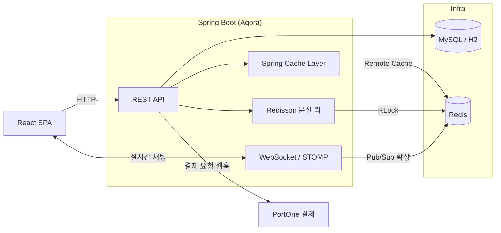

<div align="center">

# 🛒 Agora

**중고거래 커머스 플랫폼 백엔드**

실시간 채팅·네고(가격 협상)부터 선착순 쿠폰, 검색 캐싱, 결제·정산까지
하나의 중고거래 서비스를 처음부터 설계하고 구현한 백엔드 프로젝트입니다.

<br/>


</div>

---

## 목차

- [프로젝트 소개](#프로젝트-소개)
- [핵심 기술 챌린지](#핵심-기술-챌린지)
  - [1. 검색 캐싱 — v1 vs v2 성능 비교](#1-검색-캐싱--v1-vs-v2-성능-비교)
  - [2. 동시성 제어 — 선착순 쿠폰 & 거래](#2-동시성-제어--선착순-쿠폰--거래)
  - [3. 인덱스 최적화](#3-인덱스-최적화)
- [기술 스택](#기술-스택)
- [시스템 아키텍처](#시스템-아키텍처)
- [주요 기능](#주요-기능)
- [API 개요](#api-개요)
- [로컬 실행 방법](#로컬-실행-방법)
- [테스트](#테스트)
- [프로젝트 구조](#프로젝트-구조)
- [문서 & 협업](#문서--협업)
- [AI 활용 — Agent 협업 개발](#ai-활용--agent-협업-개발)

---

## 프로젝트 소개

Agora는 **판매자와 구매자가 직접 거래하는 중고거래 커머스**입니다.
단순 CRUD를 넘어 실제 서비스에서 마주치는 문제 — 트래픽이 몰리는 검색, 순간적으로 요청이 쏟아지는 선착순 이벤트, 실시간 협상 — 을 어떻게 안전하고 빠르게 처리할지에 초점을 맞췄습니다.

**핵심 도메인**

| 도메인 | 설명 |
| --- | --- |
| 상품 / 지역 | 상품 등록·조회·찜, 지역(동네) 기반 노출 |
| 검색 / 캐싱 | `LIKE` 기반 동적 검색, 인기 검색어, 검색 결과 캐싱 |
| 채팅 / 네고 | WebSocket 실시간 채팅, 가격 협상(Nego) |
| 쿠폰 / 동시성 | 선착순 쿠폰 발급, 분산 락 기반 동시성 제어 |
| 거래 / 결제 / 정산 | 거래 성사, PortOne 결제 연동, 판매자 정산 |
| 후기 / 신고 / 관리자 | 거래 후기·평점, 신고 처리, 관리자 승인·운영 |

> 설계·정책·도메인·API·ERD의 단일 출처(Source of Truth)는 **[GitHub Wiki](https://github.com/sparta-spring4/Commerce-live-chat-system-Agora/wiki)** 입니다.

---

## 핵심 기술 챌린지

이 프로젝트의 기술적 핵심은 **성능과 정합성**입니다. 아래 세 가지 과제를 "적용 전/후를 실측으로 증명"하는 것을 목표로 진행했습니다.

### 1. 검색 캐싱 — v1 vs v2 성능 비교

트래픽이 몰리는 상품 검색을 캐싱으로 얼마나 개선할 수 있는지 검증했습니다.
기존 API를 지우지 않고 **버전을 분리**해, 동일 조건에서 캐시 유무만 다르게 두고 비교했습니다.

| 구분 | 엔드포인트 | 조회 경로 |
| --- | --- | --- |
| **v1** | `GET /api/v1/products/search` | 캐시 없음 → 매 요청 DB 조회 |
| **v2** | `GET /api/v2/products/search` | Spring `@Cacheable` → **Redis Remote Cache** (TTL 60s) |

**적용 방식**
- `spring-boot-starter-cache` + `@EnableCaching`, AOP 기반 `@Cacheable`로 구현.
- 캐시 저장소는 Redis(`RedisCacheManager`), TTL 60초.
- **Cache Key 설계**: 검색어·지역·카테고리·페이지를 조합해 조건별로 분리 → 캐시 충돌 방지.
  `'search:' + keyword + ':' + regionId + ':' + category + ':' + page + ':' + size`
- **Cache-aside(Lazy Loading)** 전략: 캐시 미스일 때만 DB를 조회하고 결과를 채운다.

**k6 부하 테스트 결과** (MySQL 상품 5만 건, 300 vUser Ramp-up, 실측)

| 지표 | v1 (캐시 X) | v2 (Redis 캐시) | 개선 |
| --- | --- | --- | --- |
| **처리량(TPS)** | 744 req/s | **1,538 req/s** | **약 2.07배** ⬆ |
| 평균 응답 | 172.77 ms | **63.28 ms** | 2.7배 빠름 |
| 중앙값 | 131.78 ms | **55.64 ms** | 2.4배 빠름 |
| p95 | 375.53 ms | **263.39 ms** | 1.4배 빠름 |
| 실패율 | 0.00% | 0.00% | — |

> 💡 캐시는 단순히 평균 응답만 줄이는 게 아니라, **같은 인프라로 감당 가능한 동시 사용자 수(처리량 상한)를 끌어올린다.**
> v1은 DB 조회가 병목이 되어 TPS가 744에서 정체(포화)됐지만, v2는 캐시가 DB 부하를 흡수해 포화점이 더 높은 부하 쪽으로 이동했습니다.

📄 상세 리포트 · 재현 방법: [`docs/caching-performance-report.md`](docs/caching-performance-report.md) · 부하 스크립트: [`k6/search_load.js`](k6/search_load.js)

**인기 검색어** — Redis **Sorted Set(ZSet)** 으로 검색어별 점수를 집계하고 상위 N개를 조회합니다(`ZINCRBY`로 카운트, `ZREVRANGE`로 랭킹). 실시간·일별·주간 랭킹을 각각 제공합니다.

---

### 2. 동시성 제어 — 선착순 쿠폰 & 거래

> **"5장 한정 쿠폰에 30명이 동시에 몰려도 정확히 5장만 발급된다."**

순간적으로 요청이 쏟아져도 데이터 정합성이 깨지지 않아야 하는 지점에 락을 적용했습니다.

**락 방식 비교 분석**

| 항목 | 낙관적 락 | 비관적 락 | **분산 락 (채택)** |
| --- | --- | --- | --- |
| 관리 주체 | Hibernate `@Version` | DB Row Lock | Redis (Redisson `RLock`) |
| 보호 범위 | UPDATE 충돌 감지 | DB 수정 시점 | **비즈니스 로직 전체** (조회→검증→발급) |
| 적합 상황 | 충돌 적고 읽기 많음 | 단일 서버·충돌 잦음 | **Scale-out(서버 여러 대)** |
| 단점 | 충돌 잦으면 재시도 비용 | 락 대기·데드락 | Redis 의존성 |

**설계 결정**
- **선착순 쿠폰 → 분산 락(Redisson)**: 서버가 여러 대로 확장돼도 이벤트 단위로 정확히 직렬화되어야 하므로 분산 락을 선택했습니다.
  - Lock Key: `lock:coupon-event:{eventId}` — 같은 이벤트 경쟁자는 하나의 락을 공유하고, 다른 이벤트는 독립적으로 발급됩니다.
  - `tryLock(waitTime)` 으로 획득 실패 시 즉시 `CONFLICT`로 응답(무한 대기 방지), `finally`에서 **본인이 잡은 락만 해제**.
  - 트랜잭션 경계 분리: 락 획득(`CouponSlotService`)과 DB 작업(`CouponSlotTransactionExecutor`)을 별도 빈으로 나눠, **락이 커밋보다 먼저 풀리는 문제**를 방지했습니다.
- **거래 성사 / 네고 수락 → 비관적 락**: 단일 상품 Row에 대한 짧고 잦은 충돌이라 DB Row Lock으로 직렬화했습니다.

**동시성 검증 테스트** — `CountDownLatch` + `ExecutorService`로 스레드를 동시 출발시켜 "적용 전엔 실패, 적용 후엔 통과"를 증명합니다.

| 테스트 | Before (락 없음) | After (락 적용) |
| --- | --- | --- |
| [`CouponSlotRaceDemoTest`](src/test/java/com/team7/agora/domain/coupon/service/CouponSlotRaceDemoTest.java) | 재고 초과 발급 발생 | **정확히 재고만 발급** |
| [`LockStrategyDemoTest`](src/test/java/com/team7/agora/domain/trade/service/LockStrategyDemoTest.java) | 같은 상품 중복 판매 | **단일 거래만 성사** |
| [`CouponSlotConcurrencyIntegrationTest`](src/test/java/com/team7/agora/domain/coupon/service/CouponSlotConcurrencyIntegrationTest.java) | — | 30 요청 → 5장 발급 검증 |

> **DB 제약은 최후의 방어선.** 락이 만료되거나 Redis가 불안정한 상황까지 대비해, 유니크 제약 등 DB 레벨 정합성 가드를 함께 둡니다. 락은 경합을 줄이고, DB 제약이 최종 진실을 보장합니다.

---

### 3. 인덱스 최적화

대량 데이터에서 느려지는 검색을 인덱스 설계로 개선했습니다. **자주 함께 쓰이는 조건**을 복합 인덱스로 묶어 커버리지를 높였습니다.

```java
// Product 엔티티 — 검색·필터 패턴에 맞춘 복합 인덱스
@Table(name = "products", indexes = {
    @Index(name = "idx_products_status_deleted",        columnList = "status, deleted_at"),
    @Index(name = "idx_products_region_status_deleted", columnList = "region_id, status, deleted_at"),
    @Index(name = "idx_products_category_status_deleted", columnList = "category, status, deleted_at"),
    @Index(name = "idx_products_title",                 columnList = "title")
})
```

- 검색은 항상 `상태(판매중) + 미삭제`를 전제로 하므로 이 조건을 인덱스 선두에 배치했습니다.
- 지역·카테고리 필터가 자주 결합되므로 `(region, status, deleted)`, `(category, status, deleted)` 복합 인덱스를 별도로 두었습니다.
- 상품 5만 건을 적재하는 성능 검증 테스트(`*PerfCachingIndexTest*`)로 인덱스 유무에 따른 실행 계획 차이를 확인할 수 있습니다.

> 검색 쿼리는 QueryDSL 동적 쿼리로 작성되며, 최종 SQL은 `title`/`description`에 대한 `LIKE` 구문 + `Page` 기반 페이징(count 쿼리 분리)으로 나갑니다.

---

## 기술 스택

| 구분 | 기술 |
| --- | --- |
| **Language / Runtime** | Java 21 (Temurin) |
| **Framework** | Spring Boot 4.1, Spring Security, Spring WebSocket |
| **Persistence** | JPA(Hibernate), QueryDSL, MySQL 8(운영) / H2(로컬·테스트) |
| **Migration** | Flyway (운영 프로파일) |
| **Cache / Lock** | Redis 7, Spring Cache(`@Cacheable`), Redisson 분산 락 |
| **Realtime** | WebSocket + STOMP, Redis Pub/Sub |
| **Payment** | PortOne 결제 연동 |
| **Build / Test** | Gradle Wrapper, JUnit 5, k6(부하 테스트) |
| **Frontend** | React 19, Vite, Bootstrap, `@stomp/stompjs` |

---

## 시스템 아키텍처



- **캐시·분산 락·인기 검색어**를 모두 Redis 한 곳으로 모아 인프라를 단순화했습니다.
- 채팅은 **Redis Pub/Sub**로 브로드캐스트해, 서버가 여러 대로 늘어나도 다른 서버에 붙은 구독자에게 메시지가 전달되도록 설계했습니다(Scale-out 대비).

---

## 주요 기능

- **인증/회원** — JWT 기반 인증, 회원 가입·프로필, 관리자 계정 분리.
- **상품** — 등록·수정·삭제(soft delete), 이미지 업로드, 찜(좋아요).
- **검색** — 동적 `LIKE` 검색(v1/v2), 인기 검색어(실시간·일별·주간).
- **채팅/네고** — WebSocket 실시간 채팅, 가격 협상 오퍼(제안/수락/만료).
- **쿠폰** — 선착순 발급 이벤트, 내 쿠폰함, 관리자 이벤트 관리.
- **거래/결제/정산** — 거래 성사, PortOne 결제·웹훅, 판매자 정산.
- **후기/신고/관리자** — 거래 후기·평점, 신고 접수·처리, 관리자 승인·운영 대시보드.

---

## API 개요

대표 엔드포인트만 발췌했습니다. 전체 명세는 **[Wiki › API-Contracts](https://github.com/sparta-spring4/Commerce-live-chat-system-Agora/wiki)** 와 Postman 컬렉션([`docs/postman`](docs/postman))을 참고하세요.

| 도메인 | 메서드 · 경로 | 설명 |
| --- | --- | --- |
| 검색 | `GET /api/v1/products/search` | 상품 검색 (캐시 미적용) |
| 검색 | `GET /api/v2/products/search` | 상품 검색 (Redis 캐시) |
| 검색 | `GET /api/v1/search/popular` | 실시간 인기 검색어 |
| 쿠폰 | `GET /api/coupon-events` | 진행 중 쿠폰 이벤트 목록 |
| 쿠폰 | `POST /api/coupon-events/{eventId}/issue` | 선착순 쿠폰 발급 |
| 채팅 | `SUBSCRIBE /sub/...`, `SEND /pub/chat/{roomId}/messages` | 실시간 메시지(STOMP) |

---

## 로컬 실행 방법

### 사전 준비
- JDK 21 (Temurin)
- Docker (Redis 구동용)

### 1) Redis 실행

```bash
docker compose up -d        # redis:7-alpine, localhost:6379
```

### 2) 애플리케이션 실행 (기본 `local` 프로파일 · H2 in-memory)

```bash
# macOS / Linux
./gradlew bootRun

# Windows
.\gradlew.bat bootRun
```

- 기본 프로파일은 H2(`MODE=MySQL`)로 뜨며 `data.sql` 시드가 자동 적재됩니다.
- H2 콘솔: `http://localhost:8080/h2-console` (JDBC URL `jdbc:h2:mem:agora_db`)

### 3) 프론트엔드 (선택)

```bash
cd frontend
npm install
npm run dev        # http://127.0.0.1:5173
```

> ⚠️ **Windows에서 프로젝트 경로에 한글이 포함된 경우**, 테스트 워커 classpath argfile이 깨질 수 있습니다.
> `~/.gradle/gradle.properties`에 `localBuildDir=C:/agora-build` 같은 **ASCII 경로**를 설정하세요(커밋 금지). 자세한 내용은 [`build.gradle`](build.gradle) 상단 주석 참고.

---

## 테스트

CI와 동일하게 **전체 통합 테스트를 포함한 `clean build`** 로 검증합니다. 통합 테스트는 전체 Spring 컨텍스트를 로딩하므로 단위 테스트가 못 잡는 스키마·설정 회귀를 잡아냅니다.

```bash
# 전체 빌드 + 테스트 (CI와 동일)
./gradlew clean build          # Windows: .\gradlew.bat clean build

# 단일 테스트
./gradlew test --tests "*CouponSlotConcurrencyIntegrationTest"
```

- 부하 테스트: [`k6/search_load.js`](k6/search_load.js) (`k6 run -e TARGET=v2 k6/search_load.js`)

---

## 프로젝트 구조

```
src/main/java/com/team7/agora
├── domain/                # 도메인별 패키지 (controller · service · repository · entity · dto)
│   ├── product/ region/   # 상품 · 지역
│   ├── search/            # 검색 · 인기 검색어 · 캐싱
│   ├── chat/ nego/        # 실시간 채팅 · 가격 협상
│   ├── coupon/            # 선착순 쿠폰 (동시성)
│   ├── trade/ payment/ settlement/
│   ├── review/ report/ admin/
│   ├── auth/ user/
│   └── common/
└── global/                # 공용 인프라
    ├── config/            # Cache · Security · WebSocket 등 설정
    ├── lock/              # LockService (Redisson 분산 락 추상화)
    ├── websocket/  storage/  time/(AgoraClock)  exception/  response/
```

**컨벤션**
- 시간은 항상 `AgoraClock.now()`(UTC)를 사용합니다(테스트 시간 고정).
- 예외는 `BusinessException` + `ErrorCode`로 던집니다.
- DB 스키마는 두 경로(로컬 H2 `data.sql` / 운영 MySQL Flyway)를 함께 동기화합니다.

---

## 문서 & 협업

- 📚 **설계·정책·도메인·ERD·API의 단일 출처** → [GitHub Wiki](https://github.com/sparta-spring4/Commerce-live-chat-system-Agora/wiki)
- 📈 캐싱 성능 리포트 → [`docs/caching-performance-report.md`](docs/caching-performance-report.md)
- 🔒 분산 락 설계 노트 → [`docs/redisson-distributed-lock-guide.md`](docs/redisson-distributed-lock-guide.md)
- 🤝 운영 규칙(브랜치·PR·리뷰) → [`AGENTS.md`](AGENTS.md)

**협업 방식** — 이슈 단위 브랜치(`feature/issue-<번호>`) → PR → 코드 리뷰 → `dev` 병합. 데일리 스크럼으로 진행상황을 공유하고, 트러블슈팅과 AI 활용 내역을 기록으로 남깁니다.

---

## AI 활용 — Agent 협업 개발

AI를 단순 코드 생성기가 아니라 **역할을 나눈 팀 동료처럼** 운영했습니다.
문서를 기준점으로 두고, 정책은 사람이 결정하며, 모든 산출물을 테스트·PR로 검증하는 흐름을 지켰습니다.

> 흐름: **AI 제안 → 팀 정책 결정 → PR · 테스트 검증**

### 운영 원칙

| 원칙 | 내용 |
| --- | --- |
| **문서 먼저 읽기** | Wiki · `AGENTS.md` · API 계약을 먼저 읽혀, 프로젝트 맥락 없이 코드를 만들지 않게 했습니다. |
| **정책은 사람이 결정** | 수수료·환불 상태전이처럼 모호한 정책은 AI가 임의 구현하지 않고 `question` 라벨 이슈로 분리해 팀이 판단했습니다. |
| **작게 쪼개기** | 완료 조건·테스트 기준이 있는 **Issue 단위**로 작업을 나눴습니다. |
| **같이 코딩** | 서비스 로직 구현, 테스트 작성, 실패 로그 분석, 리팩터링 후보 정리에 AI를 활용했습니다. |
| **근거로 확인** | 실행하지 않은 테스트를 성공이라 말하지 않고, 실패 시 실제 로그를 기준으로 다시 수정했습니다. |

### Agent 역할 분담

큰 기능을 여러 Agent가 **병렬로** 구현하되, 서로 다른 `git worktree`로 격리해 충돌을 막았습니다.

| 단계 | 역할 | 하는 일 |
| --- | --- | --- |
| 1 · **Spec** | 문서 기준점 | Wiki · SA · API 계약을 읽고 구현 기준을 고정 |
| 2 · **Issue Planner** | 작업 분해 | 큰 기능을 완료 조건·테스트 기준이 있는 Issue로 분리 |
| 3 · **Dev Agents** | 병렬 구현 | 독립 worktree·브랜치에서 충돌 위험이 낮은 단위부터 구현·테스트·PR |
| 4 · **Integration** | 통합 PR | 검증된 변경만 통합 브랜치로 모아 최종 PR로 정리 |
| 5 · **Review** | 회귀 검출 | 권한·상태 전이·동시성·테스트 누락을 다시 점검 |
| 6 · **Human Team** | 정책 결정 | AI가 모르는 정책은 사람이 결정 (`question` 이슈로 분리) |

> Dev Agent의 권한은 **구현 · commit · push · PR 생성까지**입니다. `dev`/`main` 병합은 사람이 수행합니다([`AGENTS.md`](AGENTS.md) §5·§6).

### 협업 근거 (실제 산출물)

- 📄 **문서화** — [`AGENTS.md`](AGENTS.md)에 Agent 운영 규칙·역할·워크플로를 정리해, 팀원 누구나 같은 방식으로 AI를 쓸 수 있게 했습니다.
- 🧩 **Issue 분리** — 충돌 위험이 겹치는 작업은 서로 다른 worktree로 나누고, 정책 미정 항목은 `question` 라벨로 분리했습니다 (예: 정산 수수료 정책 [#147](https://github.com/sparta-spring4/Commerce-live-chat-system-Agora/issues/147), PAID 거래 환불 정책 [#159](https://github.com/sparta-spring4/Commerce-live-chat-system-Agora/issues/159)).
- ✅ **PR 검증** — 작업 결과는 통합 PR([#160](https://github.com/sparta-spring4/Commerce-live-chat-system-Agora/pull/160) 등)로 모으고, 로컬 `./gradlew clean build` 와 GitHub Actions 통과를 함께 확인한 뒤 병합했습니다.

> AI로 작성한 코드는 **PR·데일리 스크럼에서 무엇을 어떻게 활용했는지 공유**하고, 각자 코드 동작을 설명할 수 있는 상태를 유지했습니다.

---


