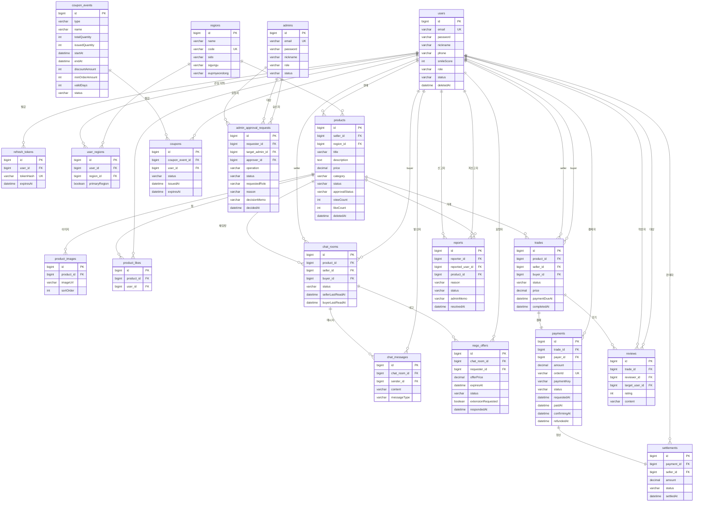

# Agora

[](https://github.com/sparta-spring4/Commerce-live-chat-system-Agora/actions/workflows/ci.yml)

> 실시간 채팅 · 가격 네고 · 선착순 쿠폰 발급을 갖춘 지역 기반 중고거래 커머스 플랫폼

구매자와 판매자가 채팅으로 가격을 협상하고, 판매자가 최종 승인하면 구매자에게 24시간 유효한 결제권이 부여되는 안전거래 구조를 중심으로 설계된 서비스입니다.

- **개발 기간**: 2026.06.22 ~ 2026.07.03 (12일)
- **팀 구성**: 풀스택 4인 팀
- **저장소**: https://github.com/sparta-spring4/Commerce-live-chat-system-Agora
- **배포**: 미배포 (로컬 실행 환경 제공)

---

## 목차

1. [팀 구성](#팀-구성)
2. [기술 스택](#기술-스택)
3. [주요 기능](#주요-기능)
4. [스크린샷](#스크린샷)
5. [아키텍처 및 도메인 구조](#아키텍처-및-도메인-구조)
6. [ERD](#erd)
7. [도메인 상태 전이 요약](#도메인-상태-전이-요약)
8. [핵심 기술 구현](#핵심-기술-구현)
9. [CI / 협업 방식](#ci--협업-방식)
10. [실행 방법](#실행-방법)
11. [문서](#문서)

---

## 팀 구성

| 이름      | GitHub | 담당 도메인                              |
|---------|--------|-------------------------------------|
| 이병우(팀장) | [116Lv](https://github.com/116Lv) | 프론트엔드 전체(인증·마켓플레이스·채팅·결제·관리자 화면), 관리자/사용자 계정 분리, 후기·거래 목록 API |
| 남동엽     | [namdongyeob](https://github.com/namdongyeob) | 네고(오퍼 정책 강화·연장 1회 제한·수락 경쟁 조건 방지), 채팅 시스템 메시지 발행, 동시성·성능 테스트(k6) |
| 김소연     | [usersy628](https://github.com/usersy628) | 쿠폰 전체(이벤트·선착순·관리자 정책·슬롯 구조 리팩토링), 지역, Flyway 초기 스키마 |
| 김준형     | [maschemy](https://github.com/maschemy) | 검색/캐싱(실시간·일간·Redis 전환), 신고, 인증 버그 수정, STOMP 채팅 버그 수정 |

---

## 기술 스택

### Backend


### Frontend


### Infra / DevOps


---

## 주요 기능

| 도메인 | 기능 |
|--------|------|
| 인증/회원 | 회원가입, JWT 로그인/로그아웃, 토큰 재발급, 마이페이지 |
| 상품/지역 | 상품 등록·수정·삭제·목록·상세, 관심 상품, 지역 관리 |
| 검색/캐싱 | 무캐시·로컬캐시·Redis 캐시 비교 검색, 실시간·일간·주간 인기검색어 |
| 채팅 | WebSocket/STOMP 실시간 1:1 채팅, 채팅방 생성·조회 |
| 네고(가격협상) | 오퍼 제안·수락·취소·연장, 동시 수락 방지 |
| 거래/결제/정산 | 거래 생성·상태 관리, PortOne 결제 사전등록·검증·웹훅, 정산 |
| 쿠폰 | 쿠폰 정책 관리, 선착순 이벤트 발급, 개인 발급, 내 쿠폰 목록 |
| 신고 | 사용자·상품 신고 접수 및 관리자 처리 |
| 후기 | 스마일 점수(거래 후기) |
| 관리자 | 관리자 계정 분리(ROOT/USER/PRODUCT/SETTLEMENT), 사용자·상품·신고·쿠폰 관리, 승인 요청 처리 |

---

## 스크린샷

| 상품 목록 | 채팅 + 네고 오퍼 | 거래 내역 |
|:---------:|:----------------:|:---------:|
|  |  |  |

---

## 아키텍처 및 도메인 구조

패키지 구조는 `com.team7.agora` 루트 아래 도메인별로 `domain/<name>` 패키지를 두고, 공용 코드는 `global/`에 모았습니다.

```
backend
└── com.team7.agora
    ├── domain
    │   ├── auth / user                       # 인증·회원
    │   ├── product / region                  # 상품·지역
    │   ├── search                            # 검색·캐싱
    │   ├── chat / nego                       # 채팅·네고
    │   ├── trade / payment / settlement      # 거래·결제·정산
    │   ├── coupon                            # 쿠폰
    │   ├── report / review                   # 신고·후기
    │   └── admin                             # 관리자
    └── global
        ├── exception     # BusinessException + ErrorCode
        ├── security      # JWT 필터, Spring Security 설정
        └── clock         # AgoraClock (UTC 고정, 테스트 시간 제어)

frontend (React)
└── src
    ├── api/        # axios API 클라이언트
    ├── auth/       # AuthContext, 인증 훅
    ├── features/   # 도메인별 컴포넌트 (chat, nego 등)
    └── pages/      # 라우팅 페이지
```

---

## ERD



ERD 상세 → [Wiki - ERD](https://github.com/sparta-spring4/Commerce-live-chat-system-Agora/wiki/ERD)

---

## 도메인 상태 전이 요약

서비스 핵심 도메인의 상태 전이입니다.

| 도메인 | 상태 목록 |
|--------|----------|
| 회원 (UserStatus) | ACTIVE → SUSPENDED / BLOCKED / DELETED |
| 상품 (ProductStatus) | SELLING → RESERVED → SOLD / HIDDEN → DELETED |
| 네고 (NegoOfferStatus) | PENDING → EXTENSION_REQUESTED → EXTENDED → ACCEPTED / REJECTED / EXPIRED / CANCELLED |
| 거래 (TradeStatus) | OFFER_ACCEPTED → PAYMENT_PENDING → PAID → COMPLETED / EXPIRED / CANCELLED |
| 신고 (ReportStatus) | PENDING → RESOLVED / REJECTED |

전체 상태 전이 규칙 → [Wiki - State Transitions](https://github.com/sparta-spring4/Commerce-live-chat-system-Agora/wiki/State-Transitions)

---

## 핵심 기술 구현

### 1. 검색 캐싱 & 어뷰징 방지 — Redis ZSET + dedup TTL + k6 성능 측정

**Problem**

두 가지 문제가 동시에 존재했습니다.

첫째, 무캐시 구조에서 k6로 300 VU 부하를 가했을 때 처리량 744 req/s, p95 응답시간 375ms로 DB 직접 조회가 병목이었습니다.

둘째, 인기검색어는 검색 횟수 기반으로 Redis ZSET 점수를 올리는 구조라, 동일 사용자가 같은 키워드를 반복 검색하면 실제 관심도와 무관하게 랭킹이 왜곡됐습니다.

```
[Before] 무캐시 → 매 요청마다 DB 조회, 744 req/s
[Before] 같은 사용자 + 같은 키워드 10회 검색 → score +10 → 랭킹 과대 반영
```

**Cause**

캐시 레이어가 없어 동일 검색 조건이 반복되어도 매번 DB 쿼리가 실행됐고, 검색 요청마다 무조건 인기검색어 점수를 증가시키는 구조였습니다.

**Solution**

무캐시 → 로컬 캐시(Caffeine) → Redis 캐시 순서로 캐싱 전략을 단계적으로 전환하고, 각 단계를 k6로 측정해 개선 효과를 정량화했습니다.

어뷰징 방지는 Redis에 `popular:keyword:dedup:{userId}:{keyword}` 키를 SETNX + TTL 1분으로 생성하는 dedup 레이어를 추가했습니다.

```
검색 요청 → keyword normalize
  ↓
SETNX popular:keyword:dedup:{userId}:{keyword}  (TTL 1분)
  ├─ 성공 → 인기검색어 score +1
  └─ 실패 → TTL 내 중복 검색 → score 증가 없음
```

`setIfAbsent`가 원자적으로 동작하므로 중복 여부를 경쟁 조건 없이 판단할 수 있습니다.

**Result**

k6 부하 테스트 결과 (300 VU · 1분 10초)

| 지표 | Before (무캐시) | After (Redis 캐시) | 개선율 |
|------|----------------|-------------------|--------|
| 처리량 (RPS) | 744 req/s | 1,537 req/s | 2.07× 향상 |
| 평균 응답 시간 | 172.77 ms | 83.28 ms | 51% 감소 |
| p95 응답 시간 | 375.53 ms | 263.39 ms | 30% 감소 |
| 에러율 | 0% | 0% | 유지 |

```
[After] 같은 사용자 + 같은 키워드 10회 검색 → 1분 안에서는 score +1
```

캐싱·검색 전략 상세 → [Wiki - Caching Strategy](https://github.com/sparta-spring4/Commerce-live-chat-system-Agora/wiki/Caching-Strategy) · [Wiki - Domain Search Caching](https://github.com/sparta-spring4/Commerce-live-chat-system-Agora/wiki/Domain-Search-Caching)

---

### 2. 동시성 제어 — Redisson 분산 락 + DB 비관적 락

**Problem**

쿠폰 선착순 발급과 네고 오퍼 수락은 기능은 다르지만, 동시에 여러 요청이 같은 제한 자원을 변경하는 공통 문제를 가집니다.

```
[Before 쿠폰] 100개 재고에 120명 동시 요청 → 초과 발급 가능
[Before 네고] 오퍼 A·B 동시 수락 → 상품 1개에 거래 2건 생성 가능
```

**Cause**

단순 상태 체크는 동시성 문제를 막을 수 없습니다. 두 요청이 동시에 들어오면 둘 다 같은 이전 상태를 읽습니다.

**Solution**

상황별로 락 전략을 다르게 선택했습니다.

| 상황 | 선택 방식 |
|------|----------|
| 여러 서버에서 같은 이벤트 재고를 차감 (쿠폰) | Redis 분산 락 (Redisson) + DB row lock |
| DB row 중심 상태 전이 (네고·거래) | DB 비관적 락 FOR UPDATE |
| 극단적 중복 생성 방지 | DB unique constraint |
| 사용자에게 명확한 실패 응답 | BusinessException(CONFLICT) |

```
[네고 수락 흐름]
오퍼 수락 요청
  ↓ NegoOffer FOR UPDATE
  ↓ Product FOR UPDATE
  ↓ 거래 생성 + 상품 RESERVED
  ↓ 같은 상품의 다른 활성 오퍼 일괄 CANCELLED
  ↓ 시스템 메시지 발송
```

모든 조회·수정에 락을 걸지 않고, 재고 차감·오퍼 수락·거래 생성처럼 중복 처리 시 복구 비용이 큰 핵심 구간에만 락 범위를 최소화해 적용했습니다.

**Result**

```
[After 쿠폰] 재고 수량만큼만 발급
[After 네고] 한 상품에 거래 1건만 생성, 중복 요청은 CONFLICT 응답
```

동시성 전략 상세 → [Wiki - Concurrency Strategy](https://github.com/sparta-spring4/Commerce-live-chat-system-Agora/wiki/Concurrency-Strategy)

---

### 3. Refresh Token 다층 보안

**Problem**

Refresh Token은 Access Token보다 수명이 길어 단순 저장·검증 구조에서 여러 보안 위험이 존재합니다.

| 위험 | 시나리오 |
|------|---------|
| DB 유출 | 원문 토큰 저장 시 공격자가 즉시 재발급 가능 |
| 토큰 탈취 | 만료 전까지 계속 재사용 가능 |
| 동시 재발급 | 같은 토큰으로 동시 요청 시 복수 토큰 발급 |
| 비활성 회원 | 정지·차단·탈퇴 이후에도 Refresh Token으로 재발급 가능 |

**Cause**

단일 방어(예: 원문 저장 후 만료 시간 체크만)로는 위 네 가지 위험을 동시에 막을 수 없습니다.

**Solution**

4단계 방어를 적용했습니다.

```
1. Hash 저장     : DB에 원문 대신 hash 값만 저장 → DB 유출 시 원문 토큰 악용 불가
2. Token Rotation: 재발급 시 기존 토큰 삭제 → 탈취 토큰 재사용 위험 감소
3. FOR UPDATE    : 재발급 시 row lock → 동시 재발급 직렬화
4. 상태 재검증   : 로그인·재발급 시 ACTIVE 확인 → 비활성 회원 즉시 차단
```

신고·차단·탈퇴 같은 회원 상태 변경을 즉시 반영해야 하므로, Stateless Refresh JWT 대신 DB-backed Refresh Token 구조를 선택했습니다.

**Result**

```
[After]
DB에는 hash만 저장 / 재발급 시 기존 토큰 폐기
동시 재발급은 row lock으로 직렬화 / 비활성 회원은 재발급 차단
```

인증 도메인 설계 상세 → [Wiki - Domain Auth Member](https://github.com/sparta-spring4/Commerce-live-chat-system-Agora/wiki/Domain-Auth-Member)

---

### 4. DB 이중 스키마 운영

**Problem**

개발·테스트 환경과 운영 환경에서 서로 다른 DB(H2 / MySQL)를 사용하다 보니, 스키마가 어긋나면 로컬에서는 통과하던 코드가 운영 배포 시점에야 깨지는 위험이 있었습니다.

**Cause**

두 환경의 스키마 관리 방식 자체가 다릅니다.

| 환경 | DB | ddl-auto | 시드 |
|------|----|----------|------|
| 개발·테스트 | H2 (MySQL MODE) | create-drop | data.sql |
| 운영 | MySQL | validate | Flyway V1~V9 |

**Solution**

엔티티·컬럼을 변경할 때마다 ① 엔티티 필드 ② `data.sql` 시드 ③ Flyway 마이그레이션 세 곳을 항상 함께 수정하는 것을 원칙으로 삼았고, GitHub Actions CI가 PR마다 전체 통합 테스트를 실행해 두 환경의 스키마 정합성을 자동 검증하도록 구성했습니다.

**Result**

세 곳 중 한 곳이라도 누락되면 H2 시드 삽입 실패(통합 테스트 실패) 또는 MySQL `validate` 실패(운영 배포 실패)로 즉시 드러나는 구조를 확보했습니다.

---

### 5. WebSocket 채팅 버그 수정 — STOMP SEND principal null

**Problem**

채팅 메시지 전송(STOMP SEND 프레임) 시 `@MessageMapping` 핸들러에서 `principal`이 항상 `null`로 전달되어 발신자를 식별할 수 없는 NullPointerException이 발생했습니다.

**Cause**

`StompAuthInterceptor`가 CONNECT 프레임에서만 JWT를 파싱하고, 이후 SEND 등의 프레임은 인증 없이 그대로 통과시키는 구조였습니다. Spring Security의 `SecurityContext`는 WebSocket 세션 간에 유지되지 않으므로, CONNECT 이후 프레임에서는 principal이 복원되지 않았습니다.

```
[Before]
CONNECT → JWT 파싱 → principal 설정 ✓
SEND    → 인증 없이 통과 → principal = null → NullPointerException ✗
```

**Solution**

CONNECT 시 파싱한 `StompPrincipal`을 WebSocket 세션 속성(`simpSessionAttributes`)에 저장하고, SEND 등 이후 프레임에서는 세션 속성에서 principal을 복원하도록 `StompAuthInterceptor`를 수정했습니다.

```
[After]
CONNECT → JWT 파싱 → StompPrincipal을 세션 속성에 저장
SEND    → 세션 속성에서 StompPrincipal 복원 → principal 정상 전달 ✓
```

**Result**

STOMP SEND 프레임에서 발신자 식별이 정상 동작하며, WebSocket 연결 유지 중 인증 정보가 끊기지 않습니다.

채팅·네고 도메인 설계 상세 → [Wiki - Domain Chat Nego](https://github.com/sparta-spring4/Commerce-live-chat-system-Agora/wiki/Domain-Chat-Nego) · [Wiki - Chat Nego Flow](https://github.com/sparta-spring4/Commerce-live-chat-system-Agora/wiki/Chat-Nego-Flow)

---

## CI / 협업 방식

- **GitHub Actions CI**: PR·dev push 시 `./gradlew clean build`(전체 통합 테스트 포함) 자동 실행, Redis 서비스 컨테이너 포함
- **브랜치 전략**: `dev` 기준 `feature/issue-<번호>-<설명>` 브랜치 → PR → 리뷰 → merge, `main`은 최종 배포 전용
- **이슈 트래킹**: `[도메인] 작업 내용` 형식 이슈, PR과 `close #번호`로 연결
- **AI 활용**: Claude Code를 활용한 코드 리뷰 자동화 및 개발 워크플로우 운영

---

## 실행 방법

**사전 조건**: Java 21, Redis

> 기본 프로파일은 **H2 인메모리 DB**를 사용합니다. MySQL은 운영 프로파일(`-Dspring.profiles.active=prod`) 전용이며 로컬 실행에는 불필요합니다.

**1. Redis 실행 (Docker)**

```bash
docker compose up -d redis
```

`docker-compose.yml`에 Redis 7 컨테이너가 정의되어 있습니다. Docker가 없다면 Redis를 직접 설치 후 `6379` 포트로 실행하세요.

**2. 백엔드**

개발 환경은 `application.yml`의 H2 기본값으로 별도 환경변수 설정 없이 바로 실행 가능합니다.

```bash
./gradlew clean build
java -jar build/libs/agora-0.0.1-SNAPSHOT.jar
```

```powershell
# Windows
.\gradlew.bat clean build
```

**3. 프론트엔드**

```bash
cd frontend
npm install
npm run dev      # 개발 서버
npm run build    # 프로덕션 빌드
```

---

## 문서

| 문서 | 링크 |
|------|------|
| 전체 API 명세 | [Wiki - API Contracts](https://github.com/sparta-spring4/Commerce-live-chat-system-Agora/wiki/API-Contracts) |
| Postman Collection | [docs/postman/agora-dev-smoke.postman_collection.json](./docs/postman/agora-dev-smoke.postman_collection.json) |
| ERD 상세 | [Wiki - ERD](https://github.com/sparta-spring4/Commerce-live-chat-system-Agora/wiki/ERD) |
| 도메인 상태 전이 | [Wiki - State Transitions](https://github.com/sparta-spring4/Commerce-live-chat-system-Agora/wiki/State-Transitions) |
| 동시성 전략 설계 | [Wiki - Concurrency Strategy](https://github.com/sparta-spring4/Commerce-live-chat-system-Agora/wiki/Concurrency-Strategy) |
| 캐싱 전략 설계 | [Wiki - Caching Strategy](https://github.com/sparta-spring4/Commerce-live-chat-system-Agora/wiki/Caching-Strategy) |
| 거래·결제 흐름 | [Wiki - Trade Payment Flow](https://github.com/sparta-spring4/Commerce-live-chat-system-Agora/wiki/Trade-Payment-Flow) |
